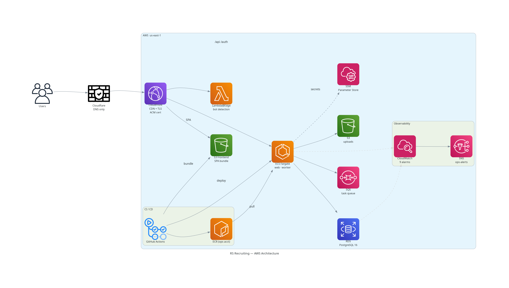
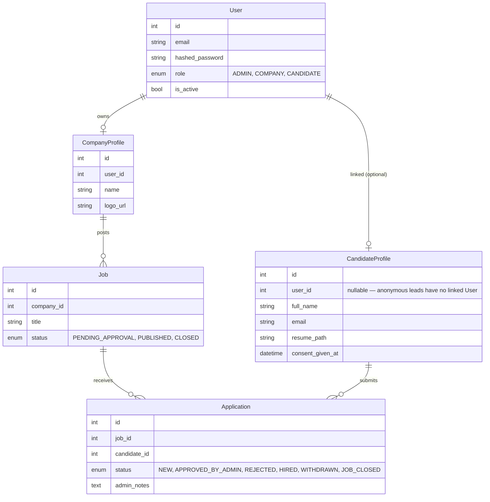

# RS Recruitment

A full-stack recruitment CRM built for a boutique agency. Manages the full pipeline from company onboarding and job posting through candidate applications to admin-gated match decisions — with a dark luxury React frontend served over a production AWS stack.

**Live:** [rs-recruiting.com](https://rs-recruiting.com)


<p><em>Public-facing site — landing page, job board, and candidate application flow</em></p>


<p><em>Admin dashboard — live stats across companies, jobs, applications, and candidates with quick-action shortcuts</em></p>

---

## Features

**Public**
- Job board with per-job detail pages and JSON-LD `JobPosting` structured data
- Candidate application form with resume upload (PDF/DOCX → S3)
- GDPR-style consent tracking: timestamp, policy version, IP, user-agent stored per submission
- SEO: dynamic sitemap.xml, robots.txt, Open Graph meta, server-side prerendered OG pages

**Admin**
- Invite-based company onboarding (token → registration → approval → activation)
- Job approval queue (review, approve, or reject postings)
- Application management with status tracking (New → Approved → Hired/Rejected/Withdrawn)
- Candidate directory with profile and resume access
- Append-only audit log: every admin action is recorded with actor, target, IP, and timestamp

**Company**
- Job posting and management dashboard
- View applications per job

**Candidate**
- Self-registration with email verification (2-hour activation window)
- Profile management (name, phone, LinkedIn URL, resume upload)
- View submitted applications and their status
- GDPR data export (profile + per-application resumes as ZIP)
- Password reset (forgot-password → email link → reset flow)

**Auth**
- JWT access token (10 min) + HttpOnly refresh cookie (7 days)
- Role-based route guards (ADMIN / COMPANY / CANDIDATE / public)
- Account lockout after 5 failed attempts (15-min cooldown, database-backed)
- Refresh token rotation: single-use tokens deleted on use, logout, or password reset

---

## Tech Stack

| Layer | Technologies |
|---|---|
| Frontend | React 19, TypeScript, Vite, Tailwind CSS v4, React Router v7 |
| Backend | FastAPI, SQLModel (SQLAlchemy + Pydantic), Alembic, Python 3.12 |
| Database | PostgreSQL 16, asyncpg (connection pool + pre-ping) |
| Background Jobs | AWS SQS + custom Python worker, EventBridge Scheduler (nightly purge) |
| File Storage | AWS S3 (production), local filesystem (dev) — provider abstraction |
| Email | Resend via SMTP relay (production) — provider abstraction; 10+ HTML templates |
| Auth | JWT (PyJWT), bcrypt, HttpOnly refresh cookie, slowapi rate limiting |
| Observability | Sentry (backend + frontend with source maps), Google Tag Manager, CloudWatch |
| Infrastructure | EKS + Karpenter + Envoy Gateway + RDS (pgvector) + S3 + SQS + ECR + SSM + CloudFront + Route 53; provisioned by Terragrunt (separate infra repo) |
| Deployment | GitOps — Helm charts + ArgoCD reconcile each cluster from the gitops repo; CI only commits image-tag bumps and never touches a cluster |
| CI/CD | GitHub Actions — OIDC auth, change detection, Pytest against PostgreSQL; continuous delivery to stage on green `main`, prod promoted by publishing a GitHub Release |
| Code Quality | Ruff, ESLint, TypeScript strict, 5 custom validation scripts, weekly pip-audit |

---

## Architecture



<p><em>Request path: Users → Route 53 → CloudFront → S3 (frontend SPA) or the EKS-hosted API via the Envoy Gateway NLB (`/api/*`, `/auth/*`, `/health` behaviors). Background jobs: SQS → in-cluster worker Deployment. Delivery: GitHub Actions builds images to the ops-account ECR and commits image-tag bumps to the gitops repo; each cluster's ArgoCD reconciles its namespace (CI never touches a cluster). Observability: in-cluster kube-prometheus-stack (Grafana + Loki), plus Sentry and CloudWatch. All secrets live in SSM Parameter Store as SecureStrings, synced into the cluster by External Secrets. (Diagram image predates the EKS migration — regenerate via `docs/generate_diagram.py`.)</em></p>

### Data model



---

## Design Decisions

**Three-tier authentication** — Admins, companies, and candidates are all full authenticated roles (ADMIN, COMPANY, CANDIDATE). Admins approve company invites; companies post jobs; candidates self-register, activate via email, and claim their applications. The schema distinguishes authenticated candidates (`user_id` linked) from anonymous leads (applications submitted before registration), enabling a seamless "register and claim" flow without breaking legacy data.

**Stateless JWT with short-lived access tokens** — Access tokens have a 10-minute TTL; refresh tokens are single-use and deleted from the database on logout or refresh. There is no blacklist — the short TTL serves as the post-logout tolerance window. Refresh token rotation (delete consumed token, issue new pair) prevents replays. Failed login attempts and account lockout are tracked on the `User` row with a `locked_until` timestamp.

**Storage and email abstraction** — Both file storage and email are behind provider interfaces. A single env var switches between local/S3 for storage with no code changes. Email providers can be SES or SMTP; production uses Resend via SMTP relay. This made local development cheap and production deployment straightforward.

**Async task queue with AWS SQS** — Sending email from inside a request handler risks timeouts and drops on provider throttling. All outbound email is pushed to an SQS queue and processed by a separate worker service (`rs_worker/worker.py`) with retry logic. Ten transactional email templates cover the full company and candidate lifecycle. The `defer_after_commit` pattern ensures tasks are enqueued only after the originating transaction commits, preventing phantom messages on rollback.

**OIDC-based GitOps continuous delivery** — GitHub Actions authenticates to AWS via OIDC (no stored credentials). A `detect-changes` job skips irrelevant work — a docs-only PR never runs backend tests or builds Docker. Every commit that lands on `main` and passes CI is built once (tagged by SHA, pushed to the ops-account ECR); CI then commits that tag into the gitops repo's stage environment and the cluster's ArgoCD reconciles it — CI never touches a cluster directly. Production is promoted by publishing a GitHub Release (`vX.Y.Z`): the exact stage-tested images are re-tagged with the version (no rebuild) and the gitops prod environment is pointed at them. A label-gated `deploy-dev` workflow ships any PR to a shared dev namespace on demand.

**Custom CI validation scripts** — Beyond Ruff and TypeScript, five custom scripts run in CI: SOC import enforcement (services must not import FastAPI), blocking I/O detection in async functions (catches `open()`, `requests.*`, `time.sleep()`), type hint coverage on public functions, test file existence checks (1:1 mapping with source files), and file size limits. Catches architecture drift that standard linters miss.

**Docker hardening** — Multi-stage build with layer caching on the lockfile. Runtime image runs as a non-root `appuser` (permissions fixed in entrypoint script). Dev and test dependencies are excluded. Health check hits the `/health` endpoint via the same proxy path a real client uses.

**SEO prerendering for a SPA** — Client-side React can't be indexed for job-specific pages. The backend generates server-side HTML snapshots with full Open Graph meta, canonical URLs, and JSON-LD `JobPosting` structured data (title, salary range, location, dates). A dynamic sitemap.xml lists all published jobs with `lastmod` from `updated_at`. Googlebot gets a real HTML response; users get the SPA.

**Hebrew-only RTL UI** — The entire frontend is in Hebrew with `<html dir="rtl">` forced globally. All UI strings live in per-namespace JSON files under `locales/he/` (13 files, one per feature area); raw backend error strings are never surfaced to the user.

---

## Testing

70+ test files, ~18k lines, parallel execution via `pytest-xdist` (each worker gets a dedicated database).

```
tests/
├── models/           # ORM model validation
├── services/         # Business logic (auth, admin, company, public, candidate flows)
├── api/              # Endpoint tests (SEO, rate limiting, request handling)
├── templates/        # Email template rendering
└── core/
    ├── services/     # Email, storage, file validation
    └── infrastructure/  # Database, config, security, transactions, rate limiting
```

Notable coverage: full auth lifecycle (invite → registration → approval → activation → login → lockout → logout), candidate registration and activation, SEO output (sitemap, JSON-LD, OG prerender), SQS task enqueue/handling (email, data export, candidate purge), storage abstraction, database transactions and rollback guarantees.

```bash
uv run pytest -n auto
```

---

## Local Development

**Prerequisites:** Python 3.12+, [uv](https://github.com/astral-sh/uv), Docker + Docker Compose, Node 18+

```bash
# 1. Clone and install (uv provisions the whole workspace: shared + api + worker)
git clone https://github.com/lahavrud/rs-recruiting-course-app.git
cd rs-recruiting-course-app
uv sync

# 2. Start backing services (PostgreSQL + Mailpit local SMTP + LocalStack)
make services            # bare `docker compose up -d`

# 3. Start backend — the schema is built by SQLModel create_all on startup.
#    Do NOT run `alembic upgrade head` locally: the migration chain is designed
#    to run on top of an existing prod schema, not a fresh database.
uv run uvicorn rs_api.main:app --reload

# 4. Start frontend (separate terminal)
cd frontend
npm install
npm run dev
```

For the full containerized split (api + worker images too) use `make up`; `make down` stops everything and `make logs` tails both services.

The frontend proxies `/api/*` to `http://localhost:8000`. Outbound email goes to [Mailpit](http://localhost:8025) — no provider account needed in development. Tasks (email, exports) run inline in the API process when `SQS_QUEUE_URL` is unset.

### Environment

```bash
# Minimum required
export JWT_SECRET_KEY=$(python3 -c "import secrets; print(secrets.token_urlsafe(32))")
```

Production env vars (AWS credentials, Sentry DSN, Resend SMTP credentials, S3 bucket) are only needed outside local dev — the defaults in `docker-compose.yml` cover everything for local work.

### Linting

```bash
uv run ruff check . && uv run ruff format --check .
cd frontend && npx tsc --noEmit && npm run lint
```

---

## Project Structure

The backend is a `uv` workspace with three members; import roots are `rs_shared` / `rs_api` / `rs_worker` (no top-level `src.`).

```
rs-recruiting-course-app/
├── libs/shared/rs_shared/    # framework-free domain — installed into BOTH images
│   ├── models.py  enums.py   # SQLModel ORM models + enums
│   ├── schemas/  templates/  assets/
│   ├── services/             # business logic, one package per actor:
│   │                         #   auth/ admin/ company/ candidate/ public/ utils/
│   └── core/                 # tasks + task_contract + matching (SQS task queue),
│                             #   infrastructure/ (config, db, security, …),
│                             #   services/ (storage, email, embeddings, cv_extraction, …)
├── services/
│   ├── api/rs_api/           # FastAPI service — main.py, api/ routers, infrastructure/ (web plumbing)
│   └── worker/rs_worker/     # SQS consumer — worker.py (console script: rs-worker)
├── frontend/src/
│   ├── pages/                # public/, admin/, company/, candidate/ + auth pages
│   ├── components/           # guards/, layout/, ui/ — shared React components
│   ├── hooks/                # useAuth, useInfiniteList, useDebounce, usePageTitle…
│   └── locales/he/           # per-namespace translation files (common, auth, admin, …)
├── tests/                    # single tree covering all three members, pytest-xdist parallel
├── scripts/                  # 5 CI validation scripts
├── alembic/                  # migrations (applied in prod only — local/test use create_all)
├── docs/                     # Architecture decisions, API design, infrastructure, runbooks
└── .github/workflows/
    ├── ci.yml                # Lint, test, docker-build (change-aware)
    ├── cd.yml                # Green main → build by SHA → bump gitops stage → ArgoCD syncs
    ├── deploy-dev.yml        # Label-gated PR deploys to the shared dev namespace
    ├── release.yml           # Publish a GitHub Release → re-tag stage images → promote to prod
    ├── redeploy-frontend.yml # Manual frontend-only respin (S3 + CloudFront)
    └── security-audit.yml    # Weekly pip-audit for CVEs
```

Helm charts and per-environment desired state live in the sibling **gitops** repo; Terragrunt IaC lives in the sibling **infra** repo.

<!-- deploy-dev pipeline exercised via PR with the `deploy` label -->
