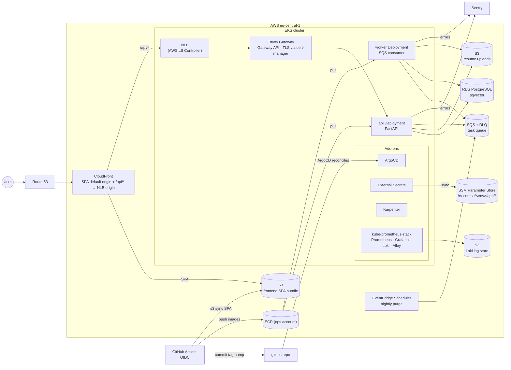
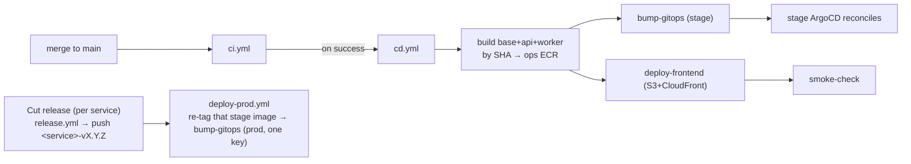

# Infrastructure — Current State

What runs in AWS, how it fits together, and *why*. The **authoritative** source
is the two sibling repos — this file is the high-level map:

- **`rs-recruiting-course-infra`** — Terragrunt IaC: the AWS org, EKS, RDS, SQS,
  S3, ECR, and all cluster add-ons.
- **`rs-recruiting-course-gitops`** — Helm charts + per-env desired state that
  ArgoCD reconciles onto each cluster.

For higher-level application decisions (auth model, framework choices, schema) see
[`ARCHITECTURE.md`](./ARCHITECTURE.md). For the delivery flow see
[`release-process.md`](./release-process.md).

**Region:** `eu-central-1`

---

## 1. Account model

An AWS Organization with four accounts (provisioned by the infra repo's
`organization` unit):

| Account | Purpose |
|---|---|
| `course-management` | Org root + billing. Runs no workloads. |
| `course-ops` | Shared ECR + GitHub OIDC role for CI image pushes. |
| `course-non-prod` | The **dev** and **stage** environments (one EKS cluster). |
| `course-prod` | The **prod** environment (its own EKS cluster). |

Images build once into the **ops-account** ECR (`rs-recruiting-course/{base,api,worker}`)
and are pulled cross-account by every environment.

---

## 2. Topology

### Notes

- **Ingress:** CloudFront fronts everything. The SPA is served from S3 (default
  behavior); `/api/*` routes to the Envoy Gateway NLB. TLS terminates at Envoy
  (cert-manager issues certs via Let's Encrypt DNS-01 against the Route 53 zone).
  The NLB hostname is an infra output and feeds CloudFront's `/api/*` origin — it
  changes on every cluster recreation, so it is never hardcoded.
- **Compute autoscaling:** Karpenter provisions nodes on demand; the environments
  are ephemeral and re-converge from scratch (destroy nightly / apply in the
  morning to save cost).
- **Secrets & config:** the infra `app-config` unit publishes all runtime config
  to SSM under `/rs-course/<env>/app/*`; External Secrets syncs that path into a
  `<release>-env` Secret each pod reads via `envFrom`. Charts carry zero endpoints
  or credentials, so recreating an environment rewires everything automatically.
- **Pod IAM (IRSA):** workloads assume per-pod IAM roles via the cluster OIDC
  provider (S3 + SQS access), so there are no node-wide credentials.

---

## 3. Cluster add-ons

Deployed by the infra repo (Helm via Terragrunt), reconciled/again by ArgoCD where
applicable:

| Add-on | Role |
|---|---|
| ArgoCD | GitOps engine — reconciles each env directory from the gitops repo |
| AWS Load Balancer Controller | Provisions the NLB fronting Envoy Gateway |
| Envoy Gateway | Gateway API ingress; terminates TLS |
| cert-manager | In-cluster TLS certificates (Let's Encrypt DNS-01) |
| External Secrets | Syncs SSM parameters into Kubernetes Secrets |
| Karpenter | Just-in-time node autoscaling |
| storage-class | EBS-backed default StorageClass |
| kube-prometheus-stack | Prometheus + Grafana + Loki (logs on S3) + Alloy DaemonSet (log shipping) |

---

## 4. Deploy pipeline

Strict GitOps — **CI never touches a cluster**. See [`release-process.md`](./release-process.md)
and `.claude/rules/infra.md` for the full flow.

- **Build once, by SHA;** promote the identical image (no rebuild for prod — the
  release re-tags the stage-tested image with the version).
- **Migrations** run as the api Helm chart's pre-install/pre-upgrade Job: fresh DBs
  get `create_all` + `alembic stamp head`; existing DBs get `alembic upgrade head`.
- **Rollback** = revert the tag-bump commit in the gitops repo (ArgoCD reconciles
  back). That restores app code only, so migrations stay backward-compatible.

---

## 5. Observability

In-cluster **kube-prometheus-stack**:

| Signal | Path |
|---|---|
| Metrics | Prometheus (node + workload); Grafana dashboards |
| Logs | Alloy DaemonSet ships container logs → Loki (single-binary, backed by S3) |
| Errors | Sentry (backend DSN from SSM, frontend DSN from build args) |

Grafana and the ArgoCD UI are reachable via the shared Envoy Gateway (or
port-forward). Access commands live in the infra repo's README.

---

## 6. Maintenance rules

1. **Infra changes live in the infra repo; workload changes live in the gitops
   repo.** This app repo only commits image-tag bumps to gitops (via CI).
2. **Keep this file a map, not an inventory.** Concrete resource IDs, ARNs, and
   Helm values belong in the infra/gitops repos, which are the source of truth.
3. **Never hardcode a dynamic endpoint** (NLB hostname, cluster name) — read it
   from the infra outputs / SSM.

---

## 7. Related docs

- [`ARCHITECTURE.md`](./ARCHITECTURE.md) — application-level decisions (auth, framework, schema)
- [`release-process.md`](./release-process.md) — delivery flow
- [`RETENTION_PURGE.md`](./RETENTION_PURGE.md) — nightly candidate-data purge runbook
